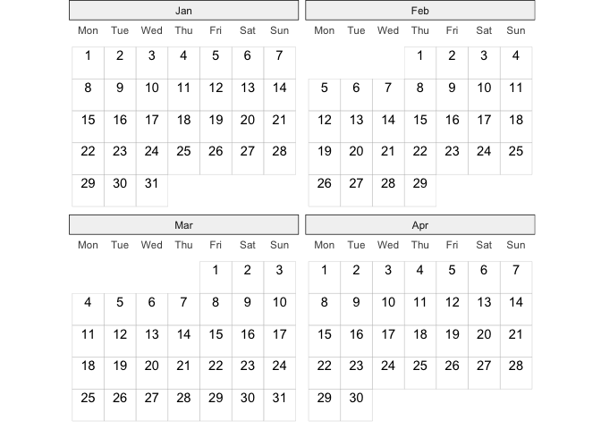
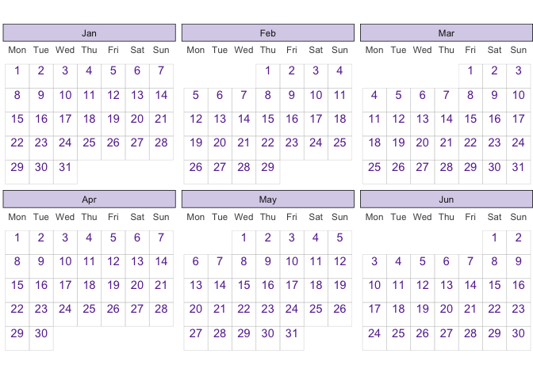
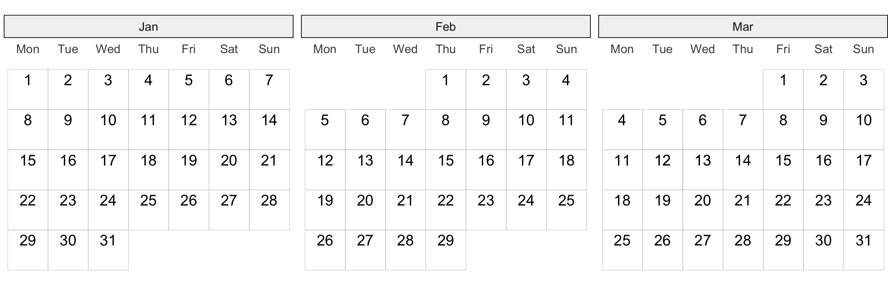
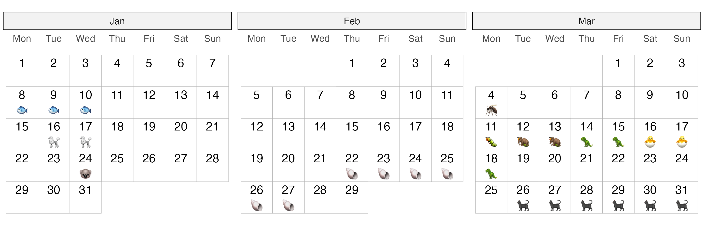
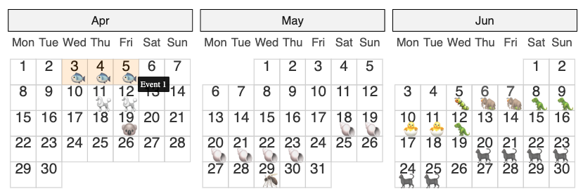

<!-- README.md is generated from README.Rmd. Please edit that file -->

# ggtilecal

<!-- badges: start -->

[](https://CRAN.R-project.org/package=ggtilecal)
<!-- badges: end -->

The goal of `ggtilecal` is to easily produce calendar layouts using
ggplot2 tile and text geoms, while retaining some customisation.

## Installation

You can install the development version of ggtilecal like so:

``` r
# install.packages("remotes")
remotes::install_github("cynthiahqy/ggtilecal)
```

## Examples

### Empty Calendar

``` r
library(ggtilecal)
make_empty_month_days(c("2024-01-05", "2024-04-04")) |>
  gg_facet_wrap_months(unit_date)
```



### Customising empty calendars

Layers in `.geom` inherit the internally generated calendar layout
mapping variables. `gg_facet_wrap_months()` provides uses lists of
sensible default layers that can be easily modified. Customise the look
of each calendar tile using `geom_tile()`, and the text number labels
using `geom_text()`.

``` r
library(ggplot2)
make_empty_month_days(c("2024-01-05", "2024-06-30")) |>
  gg_facet_wrap_months(unit_date,
                       .geom = list(
                         geom_tile(color = "grey70",
                                   fill = "transparent"),
                         geom_text(nudge_y = 0.25,
                                   color = "#6a329f")),
                       .theme = list(
                         theme_bw_tilecal(),
                         theme(strip.background = element_rect(fill = "#d9d2e9")))
                       )
```



### Adding more layers to the calendar: Event emojis!

Prepare and reshape event data into “long” form, which in this context
refers to having one row per day of an event.

``` r
set.seed(498)
events <- demo_events(10)
events
#> # A tibble: 10 × 7
#> # Rowwise: 
#>    event_id title    start      end        duration emoji details               
#>       <int> <chr>    <date>     <date>     <drtn>   <chr> <chr>                 
#>  1        1 Event 1  2024-04-15 2024-04-17 3 days   🐟    Adipiscing mauris et …
#>  2        2 Event 2  2024-04-23 2024-04-24 2 days   🐩    Sit aliquam feugiat p…
#>  3        3 Event 3  2024-05-01 2024-05-01 1 days   🐨    Lorem placerat sagitt…
#>  4        4 Event 4  2024-05-30 2024-06-04 6 days   🐚    Ipsum mollis fermentu…
#>  5        5 Event 5  2024-06-10 2024-06-10 1 days   🦟    Consectetur malesuada…
#>  6        6 Event 6  2024-06-17 2024-06-22 6 days   🐛    Sit bibendum porta ut…
#>  7        7 Event 7  2024-06-18 2024-06-23 6 days   🦣    Lorem cursus sem cubi…
#>  8        8 Event 8  2024-06-20 2024-06-24 5 days   🦖    Adipiscing fames magn…
#>  9        9 Event 9  2024-06-22 2024-06-23 2 days   🐣    Amet ligula sociis ve…
#> 10       10 Event 10 2024-07-02 2024-07-07 6 days   🐈‍⬛    Sit ridiculus id maec…
```

``` r
events_long <- events |>
  reframe_events(start, end) |>
  dplyr::slice_min(order_by = duration, n = 1, by = unit_date)
#> Reframing using grouping by: `event_id`, `title`, `duration`, `emoji`, and
#> `details`
events_long
#> # A tibble: 29 × 6
#>    event_id title   duration emoji details                            unit_date 
#>       <int> <chr>   <drtn>   <chr> <chr>                              <date>    
#>  1        1 Event 1 3 days   🐟    Adipiscing mauris et augue dapibu… 2024-04-15
#>  2        1 Event 1 3 days   🐟    Adipiscing mauris et augue dapibu… 2024-04-16
#>  3        1 Event 1 3 days   🐟    Adipiscing mauris et augue dapibu… 2024-04-17
#>  4        2 Event 2 2 days   🐩    Sit aliquam feugiat primis duis s… 2024-04-23
#>  5        2 Event 2 2 days   🐩    Sit aliquam feugiat primis duis s… 2024-04-24
#>  6        3 Event 3 1 days   🐨    Lorem placerat sagittis vehicula … 2024-05-01
#>  7        4 Event 4 6 days   🐚    Ipsum mollis fermentum in risus r… 2024-05-30
#>  8        4 Event 4 6 days   🐚    Ipsum mollis fermentum in risus r… 2024-05-31
#>  9        4 Event 4 6 days   🐚    Ipsum mollis fermentum in risus r… 2024-06-01
#> 10        4 Event 4 6 days   🐚    Ipsum mollis fermentum in risus r… 2024-06-02
#> # ℹ 19 more rows
```

We can create an empty calendar that spans the months of the events:

``` r
events_long |>
  gg_facet_wrap_months(unit_date)
```



But maybe we want to indicate which days are event days:

``` r
emoji_cal <- events_long |>
  gg_facet_wrap_months(unit_date) +
  geom_text(aes(label = emoji), nudge_y = -0.25, na.rm = TRUE)

emoji_cal
```



Additional rows are introduced within `gg_facet_wrap_months()` to plot
the non-event days. Specify `na.rm = TRUE` on subsequent layers to
silence the warning. This silently removes both the missing values
generated when calculating calendar variables AS WELL AS any “true”
missing values originating in `events_long`.

If the emojis are not rendering, try changing your graphics device. For
knitr output this can be controlled using the `dev` chunk option. For
previews in RStudio, change Settings \> General \> Graphics (e.g. to
[AGG](https://ragg.r-lib.org/)). To save use something like
`ggplot2::ggsave("ggtilecal.png", emoji_cal, height=3, width=9, dpi=300)`

## Add interactive elements

``` r
library(ggiraph)
library(ggplot2)

gi <- events_long |>
  gg_facet_wrap_months(unit_date) +
  geom_text(aes(label = emoji), nudge_y = -0.25, na.rm = TRUE) +
  geom_tile_interactive(
        aes(
            tooltip = paste(title),
            data_id = event_id
        ),
        alpha = 0.2,
        fill = "transparent",
        colour = "grey80"
    )

if(interactive()){
  ggiraph::girafe(ggobj = gi)
}
```



## Related packages & inspiration

- <https://github.com/nrennie/tidytuesday/tree/main/2023/2023-03-07>
- [ggTimeSeries](https://github.com/AtherEnergy/ggTimeSeries)
- [ggweekly](https://github.com/gadenbuie/ggweekly)
- [ggcal](https://github.com/jayjacobs/ggcal/blob/master/R/ggcal.R)
- [davidmasp/calendar-ggplot](https://github.com/davidmasp/calendar-ggplot/blob/main/calendar.R)
